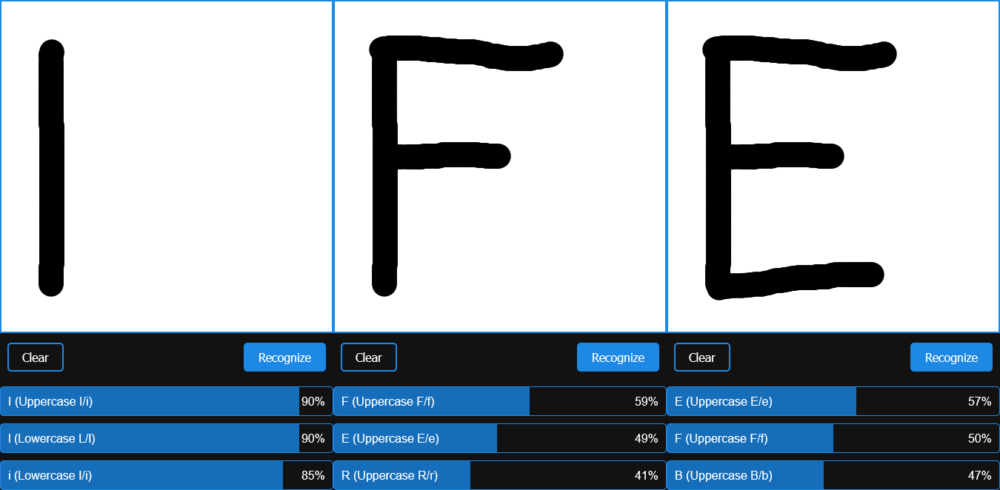
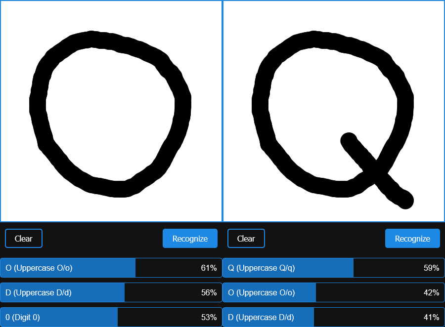

# Simple OCR

## What is this?

This is a simple demo of Optical Character Recognition (OCR). It doesn't use any machine learning models, but instead, it relies on an innovative idea I came up with.

1. Click the **Initialize OCR** button. This might cause the browser to freeze for a moment, but that's normal. Once it's ready, the canvas will light up.
2. Draw a single character on the canvas. Keep it simple; cursive writing won't work well. Also, try to use the entire canvas.
3. Click the **Recognize** button. A list of characters will appear, showing how closely they match what you drew. The character that matches the most will be listed first. It might not be very accurate, but this is just a concept I had.

**Note:** For actual serious OCR tasks, many other far better solutions are available.

## Why is this?

It was the middle of 2017. I found myself on a bus, facing a journey that stretched over three long hours. With nothing but my phone for company, my mind began to wander. For a few days, I had been intrigued by the concept of Optical Character Recognition (OCR), likely for some project I was working on at the time. Back then, I had no real understanding of AI or how it worked. All I knew was that OCR could be achieved through machine learning or pattern recognition - or something along those lines.

As the bus rumbled along, with little else to occupy my thoughts, I began to ponder how characters could be recognized. An idea started to take shape in my mind - an idea I'll reveal in just a moment (building suspense here!).

With nothing else to do, I decided to bring this idea to life. Right there on the bus, I opened an app called Quoda on my phone and started coding a simple website to test it out. Quoda, by the way, seems to have disappeared from the Play Store since then. Ah, those were the days - good days, indeed.

Since that bus ride, several years have passed, and the earth has made quite a few trips around the sun. Recently, I thought it was time to bring this idea back to life and create a demo version to share with others.

## How is this?

This simple OCR compares the character you draw with a set of pre-drawn characters and finds how closely they match.

### Pre-Processing Steps

1. **Initialize the Canvas:**
   - Before starting, you can adjust the size of the canvas. Open the browser console and run `CANVAS_SIZE = some number` to set the canvas size to your preferred value. The default size is 50x50 pixels.

2. **Draw Predefined Characters:**
   - We start by drawing a list of characters `'ABCDEFGHIJKLMNOPQRSTUVWXYZabcdefghijklmnopqrstuvwxyz0123456789'` on an internal canvas.
   - Each character is drawn using five different fonts: `'monospace'`, `'impact'`, `'cursive'`, `'serif'`, and `'sans-serif'` for variation.

3. **Cropping and Scaling:**
   - Each character is drawn in black on a white background. We crop the image to remove the extra white space around the character, trimming as much as possible.
   - The cropped character is then scaled back to 50x50 pixels.

4. **Binary Conversion:**
   - The scaled image is converted into a sequence of 0s and 1s, with a total length of 2500 (since 50*50 = 2500).
   - Each pixel is represented as either 0 (for white) or 1 (for black, indicating that the pixel is part of the character).
   - This process is repeated for every character in every font, creating a sequence of 2500 binary values for each.

### Recognition Process

1. **Character Processing:**
   - When you draw a character on the canvas, we follow the same steps: cropping, scaling, and converting the drawn character into a sequence of 0s and 1s.

2. **Sequence Comparison:**
   - We then compare this sequence with each of the pre-drawn character sequences. The comparison can be done using:
     - **Jaccard's Index (IoU):** (default) Measures the similarity between two sets.  
       $$\frac{\text{overlapping character pixels}}{\text{total number of character pixels}} = \frac{\text{intersection of black pixels (value 1)}}{\text{union of black pixels (value 1)}}$$
     - **Percentage Match:** Simply calculates the percentage of matching pixels.  
       $$\frac{\text{number of matching pixels (both black and white)}}{\text{total number of pixels (2500)}}$$
     - **Cosine Similarity:** Compares the orientation of the sequences as vectors.  
       $$\frac{\text{dot product of two sequences}}{\text{magnitude of first sequence} \cdot \text{magnitude of second sequence}}$$

3. **Selecting the Best Match:**
   - Once we have the match percentage between the drawn character and each of the pre-drawn sequences, we choose the best match.
   - The best match across all fonts for each character can be selected using methods like:
     - **Median:** The middle value of the sorted match percentages.
     - **Max:** (default) The highest match percentage.
     - **Average:** The mean of the match percentages.

4. **Output:**
   - The match percentages for each predefined character are printed, allowing you to see how closely the drawn character matches each one.

**Note:** If you want to change the method used for sequence comparison or how the best match is selected, you can edit the code and run it locally. The code for different methods is already included but commented out. You can uncomment and modify it as needed to experiment with different approaches.
